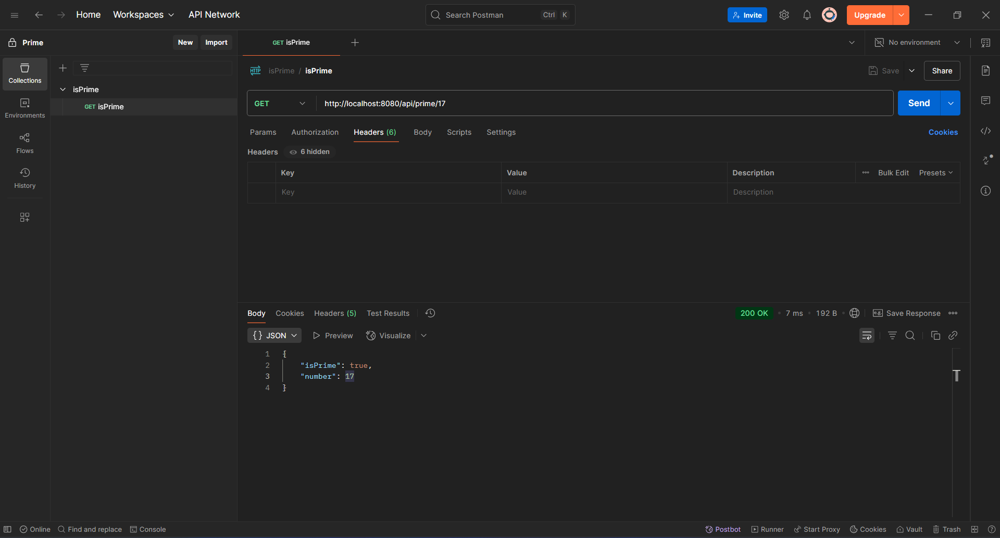

# Prime Checker API

## How to Run

### 1. Clone the repository
```bash
git clone https://github.com/nikhilmangali1/Prime.git
```

### go to project directory
```
cd Prime
```

### 2. Build the project using Maven
```
mvn clean install
```

### 3. Run the Spring Boot application
```
mvn spring-boot:run
```

### The application will start at=> http://localhost:8080

## How to Test in Postman
1. Open Postman
2. Select GET request
3. Enter the URL:
```
http://localhost:8080/api/prime/17
```
4. Click Send
5. You will receive a response like:
```
{
    "isPrime": true,
    "number": 17
}
```

## Here are some example outputs.



